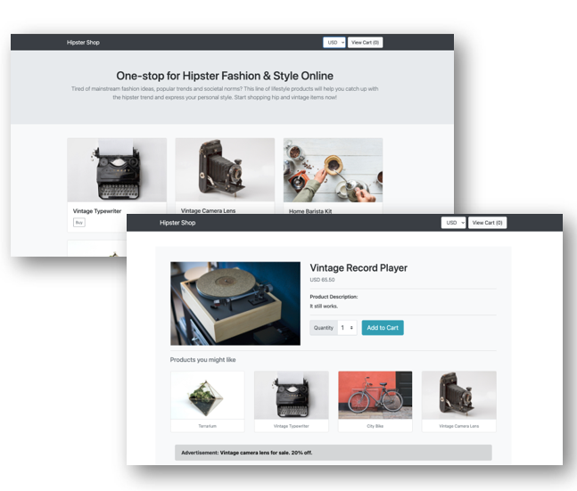

# DOUniversity Final Project


## Project Background

Hipster shop is an e-commerce that focuses on providing it's users a one-stop for hipster fashion and style items where users can browse items, add them to the cart, and purchase them. 



It is designed on a microservices architecture ready to be deployed in a kubernetes cluster as it is dockerized and has its kubernetes manifests declared.

Currently, there is no specification of the infrastructure that will be used to deploy production, and a new team of Devops have been requested to automate the deployment process and to tune the security up.

The micro services architecture goes as follows:


| Service               | Language      | Description                                                  |
| --------------------- | ------------- | ------------------------------------------------------------ |
| frontend              | Go            | Exposes an HTTP server to serve the website. Does not require signup/login and generates session IDs for all users automatically. |
| cartservice           | C#            | Stores the items in the user's shipping cart in Redis and retrieves it. |
| productcatalogservice | Go            | Provides the list of products from a JSON file and ability to search products and get individual products. |
| currencyservice       | Node.js       | Converts one money amount to another currency. Uses real values fetched from European Central Bank. It's the highest QPS service. |
| paymentservice        | Node.js       | Charges the given credit card info (mock) with the given amount and returns a transaction ID. |
| shippingservice       | Go            | Gives shipping cost estimates based on the shopping cart. Ships items to the given address (mock) |
| emailservice          | Python        | Sends users an order confirmation email (mock).              |
| checkoutservice       | Go            | Retrieves user cart, prepares order and orchestrates the payment, shipping and the email notification. |
| recommendationservice | Python        | Recommends other products based on what's given in the cart. |
| adservice             | Java          | Provides text ads based on given context words.              |
| loadgenerator         | Python/Locust | Continuously sends requests imitating realistic user shopping flows to the frontend. |

## Technologies Justification

It was decided that a managed infrastructure was implemented on Azure cloud to host our resources because the team has more expertise with it and offers a wide range of resources, making it easier for us to deploy our infrastructure in one place.

Github is the most used tool for version control and many companies use it. The advantage of Github, it can do pipelines in such an easyway to automate the repetitive proccesses saving time when doing the CI / CD. You can trigger different workflows to build a complete web application and deployed it into the cloud service. Many developers helps with different libraries to get the best automation into your pipeline.

We chose Terraform for our IaC tool because it is an specialised HashiCorp provisioning tool that supports azure cloud. Using Terraform really eases up the development process as we only have to run one command to get our infrastructure up in case an error ocurrs or the environment has to be changed.

We decided to use Helm because there's a lot of support both from the community and tech companies, thanks to this there's a helm chart for almost everything that you want to set up in a cluster. We also decided integrating this tool to have a standardized and reusable deployment, improving developer productivity in the near future.

We used Vault to keep our sensible data safe and secure, in addition to the great documentation that hashicorp provides we opted for this tool because it has a lot of flexibility both for authentication methods and secrets storage, while maintaining it's key feature, data encryption.


## Tools

**Cloud provider**: Azure

- AKS
- ACR
- VM's
- Storage Account

**CI/CD**:

- Github
- Github Actions

**Provisioning**:

- Terraform
- Ansible

**Containers/Orchestration**:

- Kubernetes
- Helm

**Secret Manager**: 
- Vault


## Usage Guide

1. [Deploy the app from local machine](./documentation/deploy_from_localmachine.md)


1. [Deploy the app with Github Actions](./)

---

# Quickstart 

## Prerequisites

1.  Azure subscription

1.  Azure CLI

1.  Terraform

1.  Ansible

1.  Kubectl

1.  Helm

If you don't have all the requirements visit the next documentation to insall all the packages you need: [Provision the infrastructure](./documentation/infra-guide.md)

1. Clone this repository

```
git clone https://github.com/RicardoMoraDou/microservices-demo-1.git
cd microservices-demo-1.git
```

2. Set your Azure credentials

```
az login
az account set --subscription "<SUBSCRIPTION_ID>"
```

3. Create service principal

```
az ad sp create-for-rbac --name "servicePrin_Name" --role contributor \
    --scopes /subscriptions/{subscription-id} \
    --sdk-auth
```

4. From the output of previous command, export the service principal credentials

```
export ARM_SUBSCRIPTION_ID=<SUBSCRIPTION_ID>
export ARM_CLIENT_ID=<appID>
export ARM_CLIENT_SECRET=<password>
export ARM_TENANT_ID=<tenant>
```

5. Create a resource group

```
az group create -l <REGION> -n <RESOURCE_GROUP_NAME>
```

6. Create a storage container for terraform state

```
az storage account create --resource-group <RESOURCE_GROUP_NAME> --name <STORAGE_ACCOUNT_NAME> --sku Standard_LRS --encryption-services blob

ACCOUNT_KEY=$(az storage account keys list --resource-group <RESOURCE_GROUP_NAME> --account-name <STORAGE_ACCOUNT_NAME> --query '[0].value' -o tsv)

az storage container create --name <CONTAINER_NAME> --account-name <STORAGE_ACCOUNT_NAME> --account-key $ACCOUNT_KEY
```

7. Provision the infrastructure

```
cd <TERRAFORM DIRECTORY PATH>

terraform init

terraform apply
```

8. Create Container Registry and Login to ACR

```
az acr create --resource-group <RESOURCE_GROUP_NAME> --name <CONTAINER_NAME> --sku Basic --admin-enabled true

az acr login --name <REGISTRY-NAME>
```

9. Create Container Registry and Login to ACR

```
az acr create --resource-group <RESOURCE_GROUP_NAME> --name <CONTAINER_NAME> --sku Basic --admin-enabled true

az acr login --name <REGISTRY-NAME>
```

10. Build each Microservice from the Directory SCR 

(Note: For this step we recommended to create a bash script to build all the images at the same time)

```
az acr build  --registry <CONTAINER_NAME> --image <NAME>:latest <PATH_DOCKERFILE_MICROSERVICE>
```

11. Install the app into Kubernetes

```
az aks update -n <AKS_NAME> -g <RESOURCE_GROUP_NAME> --attach-acr <LOGIN_SERVER>
```

12. Install the app into Kubernetes

```
helm install <NAME> ./<HELM_CHART_PATH>
```
13. Create a private SSH key

```
ssh-keygen -t rsa
```

14. Install Vault into VM with ansible

```
ansible-playbook playbook.yaml -i inventory -u azureuser  --private-key id_rsa
```


