# Deploy app from Github Actions

## Prerequisites

1.  Azure subscription

1.  Azure CLI

You need the next infrastructure in your Azure Portal subscription to apply this installation method [Infrastructure](./infra-guide.md) 

## Installation 

To install and run all the app with few steps follow the next to prepare the neccesary information to saved in Github Secrets

1. Fork the repository.

    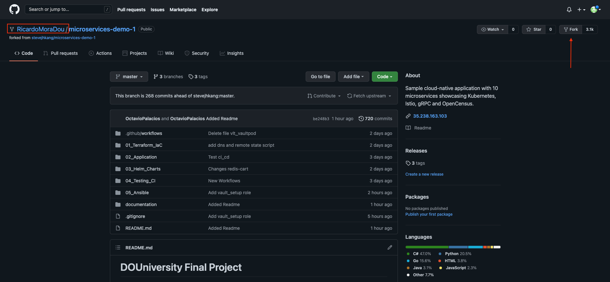

    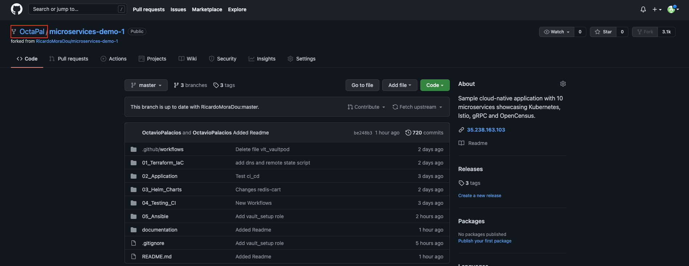

2. Create Secrets in GitHub

    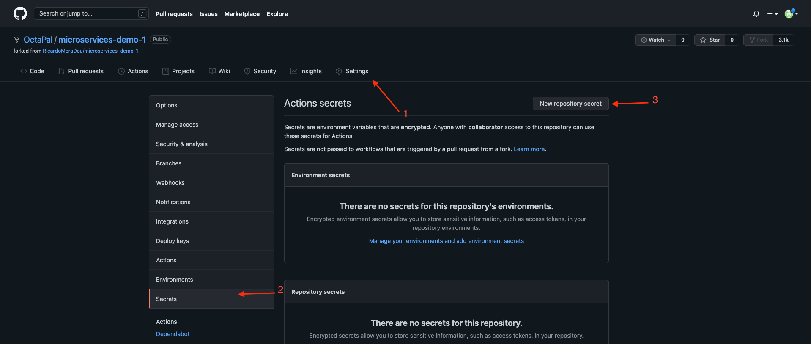 

    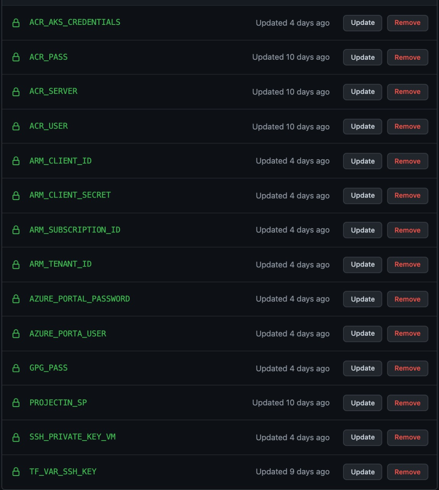  


| Service                | Language      | 
| ---------------------- | ------------- | 
| ACR_AKS_CREDENTIALS    | All the credencitial obtained from the command of the service principal|
| ACR_PASS               | CLIENT_SECRET| 
| ACR_SERVER             | URL OF THE ACR SERVER| 
| ACR_USER               | CLIENT_ID | 
| ARM_CLIENT_ID          | CLIENT_ID | 
| ARM_CLIENT_SECRET      | CLIENT_SECRET |
| ARM_SUBSCRIPTION_ID    | SUBSCRIPTION_ID  |         
| ARM_TENANT_ID          | TENANT_ID  |
| AZURE_PORTAL_PASSWORD  | PASSWORD AZURE PORTAL ACCOUNT |
| AZURE_PORTA_USER       | EMAIL AZURE PORTAL ACCOUNT| 
| GPG_PASS               | PRIVATE SSH KEY GENERATED FROM COMMAND ssh-keygen -t rsa -b 4096 ENCRYPTED |
| PROJECTIN_SP           | All the credencitial obtained from the command of the service principal |
| SSH_PRIVATE_KEY_VM     |PRIVATE SSH KEY GENERATED FROM COMMAND ssh-keygen -t rsa -b 4096|
| TF_VAR_SSH_KEY         |PRIVATE SSH KEY GENERATED FROM COMMAND ssh-keygen -t rsa -b 4096 FOR TERRAFORM DEPLOY|

3. Create a branch

````
git checkout -b <NAME_BRANCH>
````

4. Access to the next directory.

    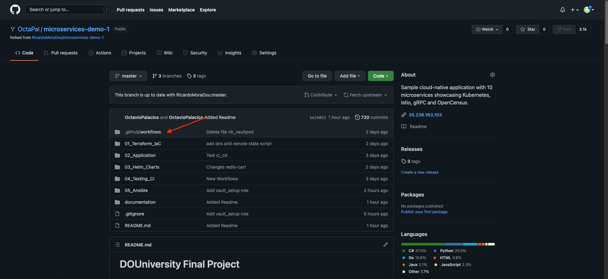

5. Modify the file 01_init_terraform_infra.yml into the directory.

- Add one space in the first line 

    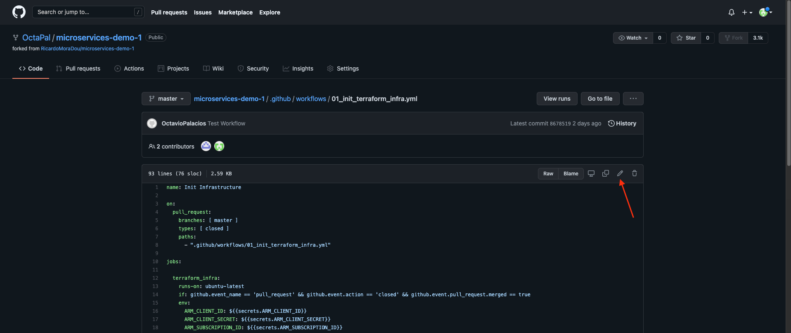

- Make a commit to run the workflow

    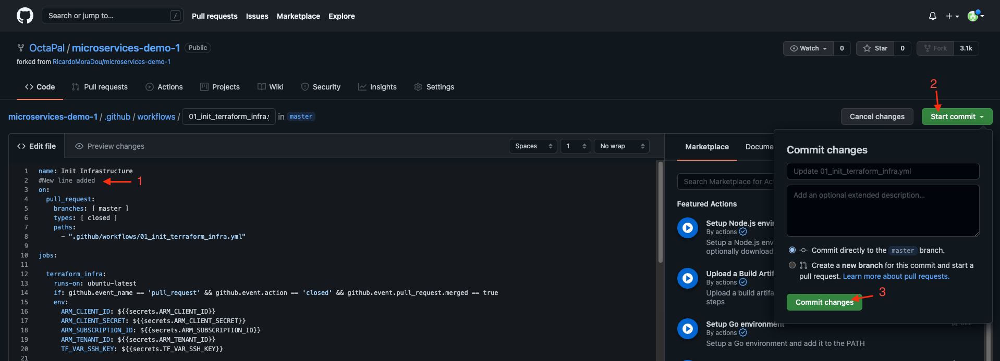

6. Do a pull request

    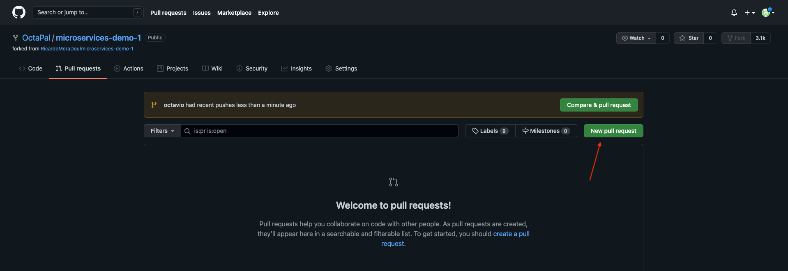

- Select your repository

    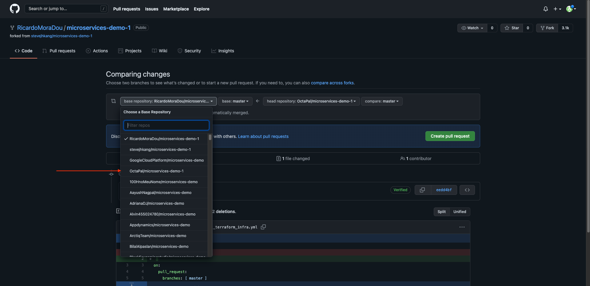

- Select branch you are working on

    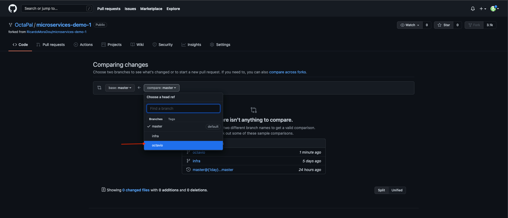
 
    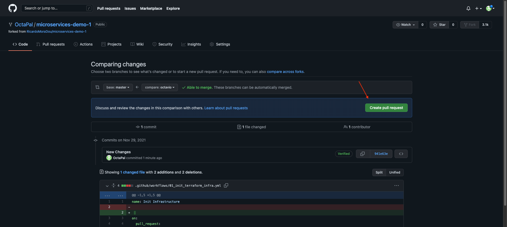

    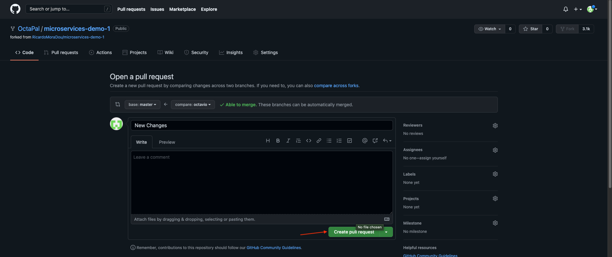

- Approve the merge request

    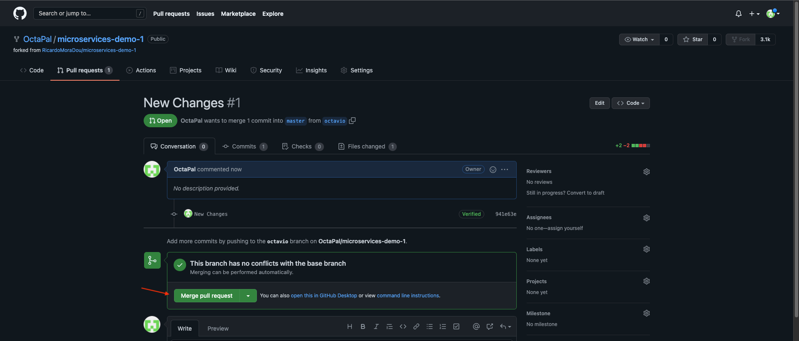

7. Workflow it's running

    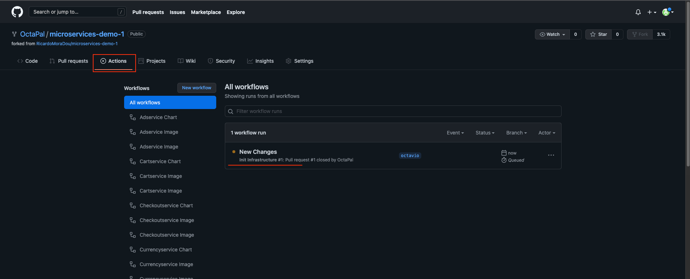


